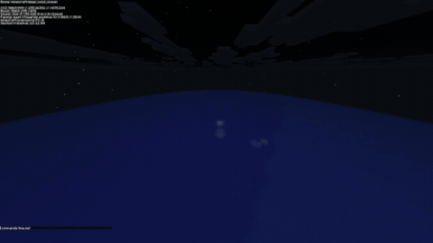

<div align="center">
  <a href="https://www.youtube.com/watch?v=cE0wfjsybIQ&t=73s"></a>
  <a href="https://github.com/4lve/SteelMC/blob/master/LICENSE"></a>
  <a href="https://discord.gg/MwChEHnAbh"></a>
  
  
  
</div>
<!-- PROJECT LOGO -->
<br />
<div align="center">
  

  <h3 align="center">SteelMC - Minecraft implemented the right way.</h3>

  <p align="center">
    Built in Rust, with multithreading in mind. We aim for vanilla parity,<br />performance, clean code and customization.
    <br />
    <a href="https://steelmc.dev/"><strong>Explore the docs</strong></a>
    <br />
    <br />
    <a href="#features">Features</a>
    &middot;
    <a href="#roadmap">Roadmap</a>
    &middot;
    <a href="#our-approach">Our approach</a>
    &middot;
    <a href="https://steelmc.dev/tracker/">Tracker</a>
    &middot;
    <a href="#contributing">Contributing</a>
    &middot;
    <a href="#acknowledgements">Acknowledgements</a>
  </p>

<br />

</div>

<br />
<br />

## Features

> [!IMPORTANT]
> Steel targets **Minecraft 26.2** and is under active development — some systems are still being built out.

🌍 **World Generation** — Fully implemented and multithreaded. Terrain, biomes, caves, structures (villages, strongholds, monuments, fortresses, and more), and lighting are all vanilla-compliant and generated on a dedicated thread pool.

🧱 **Blocks, Items & Fluids** — Over 100 block behaviors, tool and item interactions, water and lava flow — all functioning with vanilla parity. Redstone is in progress.

🐷 **Entities & Combat** — Entity lifecycle, physics, goal-based AI with pathfinding, attributes, equipment, enchantments, damage pipeline, loot tables, and mob effects. Early but growing — more entity types are being added continuously.

🎒 **Player Systems** — Inventory, crafting, hunger, experience, all four game modes, and 24+ commands with tab completion. Secure chat and Mojang authentication fully implemented.

🗺️ **Persistence & Multi-World** — Chunks, player data, and world state save and load across restarts using vanilla-compatible region files. Multiple worlds are supported via a domain-based configuration.

🌐 **Networking** — Complete protocol implementation with compression, packet bundling, and view-distance aware chunk streaming.

## Roadmap

## Our approach

Steel is built around the idea that getting the foundations right makes everything else easier. Rather than rushing to implement content, we focus on designing robust, high-performance core systems — registries, codegen pipelines, chunk management, entity architecture — so that adding new blocks, entities, or mechanics becomes straightforward and reliable. The server is written in Rust with multithreading at its core: world generation runs on a dedicated thread pool, networking is fully asynchronous, and game data is compiled at build time rather than parsed at runtime. The result is a server that aims for exact vanilla parity while being significantly faster, with an architecture designed from the ground up for future extensibility and customization.

## Acknowledgements


## 🔗 Links
<div align="center">

[Discord](https://discord.gg/MwChEHnAbh) | [GitCraft](https://github.com/WinPlay02/GitCraft)
</div>


## How to install steel

We have pre-built binaries, but also docker and eggs.
More information can be found [here](https://steelmc.dev/guides/getting-started/installation/)

## ⚙ How to Contribute

1. Identify a feature you'd like to add or an issue to work on.
   You should always create a post in the channel [feature-discussion](https://canary.discord.com/channels/1428487339759370322/1429074039015473272) when considering adding a major feature.
2. Decompile Minecraft 26.1 by running the provided script:
   ```bash
   ./update-minecraft-src.sh
   ```
   This will clone GitCraft and generate the decompiled source in `minecraft-src/`.
3. Fork the `master` branch of this repository.
4. Examine the vanilla implementation and translate it into idiomatic Rust as cleanly and efficiently as possible.
5. Commit your changes to your fork and open a pull request.

> [!NOTE]
> It is highly recommended to join the [Discord server](https://discord.gg/MwChEHnAbh) and reach out to [4lve](https://github.com/4lve) if you have code-related questions or encounter any ambiguities.

> [!IMPORTANT]
> This project is still in a very early stage of development.

### Precommit Hook
This repository uses [prek](https://prek.j178.dev/) to ensure that all commits follow the style guide and makes sure the cicd will pass.
To install the hook, some things needed to be installed first:
```bash
cargo install prek typos-cli --locked
```

Then you can run `prek install` to install the hook and it is configured to run automatically before every commit.
It will fix some things already for you, but the commit will still fail and please check the changes.

### Top contributors:

<a href="https://github.com/Steel-Foundation/SteelMC/graphs/contributors">
  
</a>